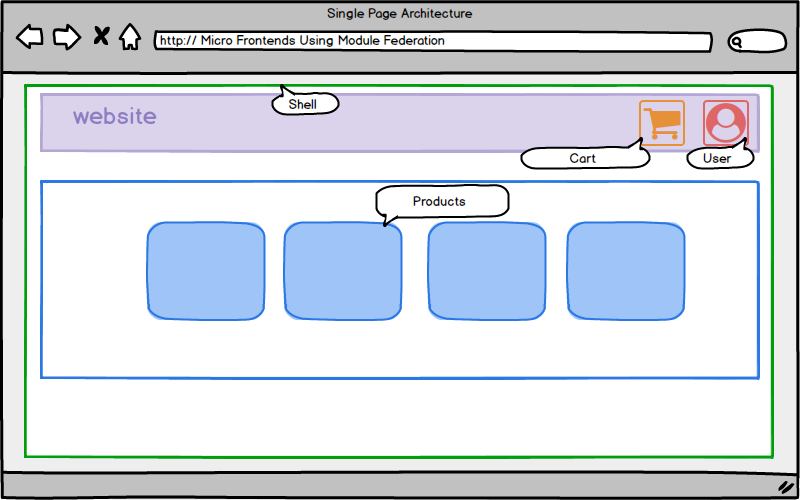

# mfe-shopping

Lets build a micro frontend Using Module Federation in Angular. We can build a sample shopping cart app.

Module Federation allows loading Micro Frontends at runtime. Module Federation is an integrated part of web pack 5, and hence, it works with all modern web frameworks. In order to allow loading separately compiled and deployed micro frontends, Module Federation defines two roles: the host and the remote that is a container and your micro frontends.

Since angular 12 angular CLI uses the webpack 5 so we can easily add the module federation plugin using ng add @angular-architects/module-federation in both of container and your micro frontend. We just have to configure exposed moduled in the container as well as micro frontend

We see a banner with a shopping cart and an user accounts section, and products all within a shell. The shopping cart is its own app. The products are their own as well. All connected within the shell. 

And lets see now.

**Set up the sample app with no tests, just as a sample quick build out**. 

`ng new angular-microfrontend-example --create-application false --minimal

cd angular-microfrontend-example

ng g application shell --routing --style css --inline-style

ng g c products --project shell

ng g c products/product --project shell --flat

ng g library shared

ng g interface product --project shared

ng g service products --project shared

ng g service cart --project shared

ng g application mfe-cart --routing --style css --inline-style

ng g c home --project mfe-cart

ng g module cart --project mfe-cart --routing --route cart --module app

ng add @angular-architects/module-federation --project shell --port 4200

ng add @angular-architects/module-federation --project mfe-cart --port 4201`

## Check Projects
You will see the mfe-cart, shared, and shell. 
In shell you will see the product and products components. 
In the shared, you will see the library, where the cart service is, products service, shared service is, and the shared component is. 
The cart is pretty simple by itself. I have not added a User at this time. But tht could be added as an authenicated user via the federation. 

These applications, mfe-cart and shell, act like, or would have been an angular module in past versions, but are now stand-alone micro front-end apps. The cart could be fully created in ReactJs, or so could the products be extracted and build as ReactJS. This is the key we are looking at now. 

### Future app:

Angular-SpringBoot-CRUD-FullStack-App